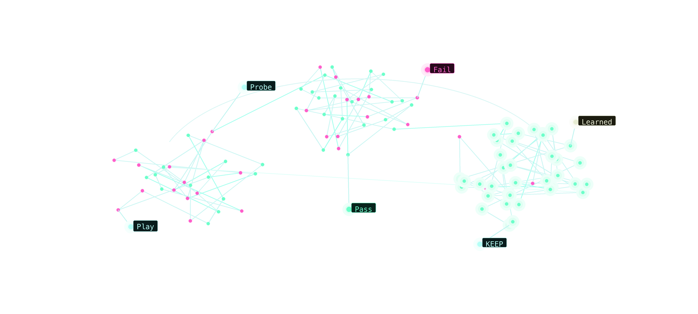
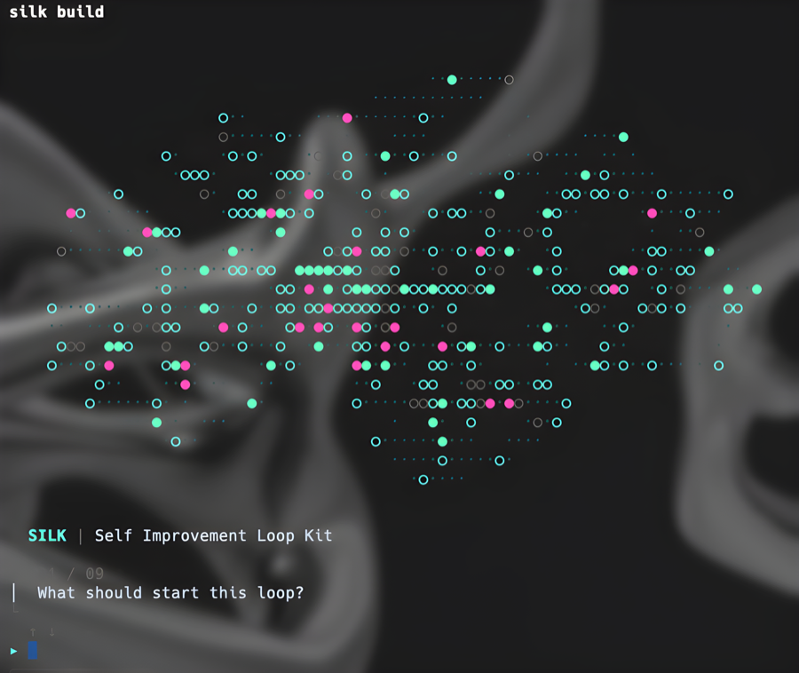
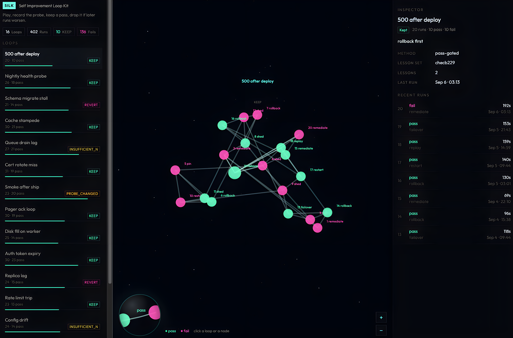

# Self Improvement Loop Kit



Self Improvement Loop Kit interviews you for the playbook, then writes that file plus a harness. Three beats:

- **Play** — a normal agent turn. Paste `playbook.md`. The agent runs until the probe passes or hits the budget. Do not edit the probe, `loop.yaml`, or prior JSONL.
- **Pass** — the probe command exits clean. That is the only yes.
- **Learn** — after a real pass, promote one lesson. The next play reads the playbook.

`silk play --repo .` is not the Play. It writes the exam down: `record-run`, then `silk learn` if `"pass": true` (one `## Learned (probe-gated)` bullet), then `silk verdict`. Open `http://127.0.0.1:9348` for KEEP / REVERT from fail rate and time-to-green — not from a memory store. No model inside `silk`.

## Setup



```
silk install
```

PATH + Cursor, Claude Code, Codex. No questions.

Then interview:

```
silk build
```

in the project to harness. Or `/self-improvement-loop-kit` in a client.

`silk install` links the skill into:

- Claude Code: `~/.claude/skills/self-improvement-loop-kit`
- Codex: `~/.agents/skills/self-improvement-loop-kit`
- Cursor: `~/.cursor/skills/self-improvement-loop-kit` and `~/.cursor/commands/self-improvement-loop-kit.md`

Keep using this checkout’s `scripts/` and `visualize/`. Do not fork lint, emit, or record-run.

**Interview two ways**

- In Cursor, Claude Code, or Codex: `/self-improvement-loop-kit` (or the skill). The agent asks the nine questions in chat, you review, then emit.
- In a terminal, in the project to harness: `silk build`

Same emit. It does not run the play and does not populate the board.

## After emit

1. **Play.** Paste `playbook.md` into a normal agent turn. It runs until the probe passes or hits the budget. Do not edit the probe, `loop.yaml`, or prior JSONL. Do not use Cursor `/loop` (that is a timer).
2. **Pass.** Only the probe exit code counts.
3. **Learn.** When the probe is green or you hit the budget: `silk play --repo .` — that records the line, promotes one lesson if `"pass": true`, then KEEP or REVERT. The next Play reads `playbook.md`.
4. `silk ui` opens the board at **http://127.0.0.1:9348** (or the URL it prints).
5. To record a play on a schedule or a failing check, copy `templates/play.github-action.yml` to `.github/workflows/silk-play.yml` in the harnessed repo. That job is the writeback, not the agent turn.

## SILK UI - Visualize Your Loop



`silk ui` plots `loop-kit/scoreboard.jsonl` from the harnessed repo at **[http://127.0.0.1:9348](http://127.0.0.1:9348)**. First time the board is empty: interview (`silk build` or `/self-improvement-loop-kit`) so you have a `playbook.md`, follow that playbook, then `silk play --repo .` records the first run. How to read it: [visualize/README.md](visualize/README.md).

- **Filters → pass / fail** — probe exit code. Green node = pass, pink = fail.
- **Filters → lesson set** — `learned_hash`: fingerprint of playbook `## Learned (probe-gated)` at that run. Same set = same lessons. A `silk learn` bullet starts a new set.
- **Actions** — `actions` from the scoreboard line (what the remediator did).
- **Runs** — each scored play under its lesson set (passed/failed, when, time-to-green).
- **Trend** — KEEP / REVERT / not enough runs / probe changed. One green line is not enough.

Click a filter to show only matching nodes.
